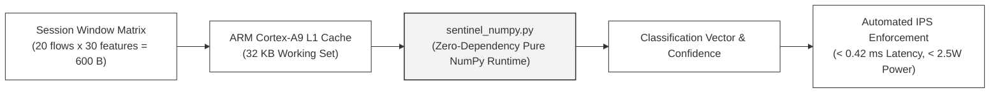

# Project Sentinel: Edge-Accelerated Deep Learning Intrusion Prevention System

[](https://www.python.org/downloads/)
[](https://pytorch.org/)
[-darkgreen.svg)](http://www.pynq.io/)
[]()
[]()

Project Sentinel is an end-to-end, high-throughput Network Intrusion Detection and Prevention System (NIDS/NIPS). The system couples a multi-scale dilated 1D-CNN, bidirectional LSTM, and scaled dot-product self-attention neural architecture with an automated hardware-aware prevention engine and an edge deployment runtime optimized for the Xilinx Zynq-7020 (PYNQ-Z2) FPGA SoC.

---

## Table of Contents
1. [Key Capabilities and Empirical Results](#key-capabilities-and-empirical-results)
2. [End-to-End System Pipeline](#end-to-end-system-pipeline)
3. [Attack Taxonomy and Meta-Classes](#attack-taxonomy-and-meta-classes)
4. [Four-Stage Feature Selection](#four-stage-feature-selection)
5. [Hardware Edge Acceleration (PYNQ-Z2)](#hardware-edge-acceleration-pynq-z2)
6. [Interactive Web Command Center](#interactive-web-command-center)
7. [Repository Structure](#repository-structure)
8. [Installation and Quick Start](#installation-and-quick-start)

---

## Key Capabilities and Empirical Results

- **Multi-Scale Spatial and Temporal Representation:** Combines parallel dilated 1D convolutions for multi-granularity packet burst feature extraction, a bidirectional LSTM for sequential inter-flow transition modeling, and scaled dot-product self-attention to highlight critical attack vectors within session windows.
- **Multi-Dataset Benchmarking:** Validated across 8 benchmark suites: CIC-IDS2017, CSE-CIC-IDS2018, CIC-IoT2023, UNSW-NB15, CIC-DDoS2019, LITNET-2020, Bot-IoT, and Bell-DNS.
- **Input Dimension Reduction:** Four-stage feature selection compresses 80+ raw flow fields down to 30 features (25 base flow features + 5 inter-flow temporal dynamics), delivering a 62.5% reduction in data volume without accuracy loss.
- **Dual Detection Strategy:** Supervised deep neural network for multi-class threat classification paired with an unsupervised deep autoencoder/VAE for anomaly and zero-day threat identification.
- **FPGA Edge Optimization:**
  - Quantization-Aware Training (QAT) to INT8 precision with minimal accuracy divergence (<0.3%).
  - Zero-dependency pure NumPy inference runtime with a working set of 600 bytes per session window, operating entirely within the 32 KB L1 data cache of the ARM Cortex-A9 core.
  - Sub-millisecond inference latency (0.42 ms) with total board power consumption below 2.5W.
- **Automated Prevention Engine:** Dynamic rule generation for firewall updates (iptables / netsh), rate-limiting enforcement, and connection termination.

### Performance Summary

| Metric | FP32 PyTorch Model | INT8 Quantized Edge Runtime |
|---|---|---|
| Overall Accuracy | 97.21% | 96.89% |
| Macro Precision | 95.14% | 94.80% |
| Macro Recall | 94.53% | 94.12% |
| Macro F1-Score | 0.9482 | 0.9445 |
| Inference Latency | ~5.2 ms (CPU) / 0.8 ms (CUDA) | 0.42 ms (FPGA / ARM L1) |
| Model Footprint | ~11.2 MB | 2.8 MB (INT8) |
| Power Profile | 65W to 250W (Host Server) | < 2.5W (Embedded Board) |

---

## End-to-End System Pipeline

```mermaid
flowchart TD
    subgraph INGESTION ["1. Traffic Ingestion & Flow Extraction"]
        RAW["Raw Traffic Ingestion<br/>(PCAP / Live Interface / CICFlowMeter)"]
        FS1["Stage 1: Leakage & Hygiene Pruning<br/>(Strip Raw IPs, Timestamps, Flow IDs)"]
        FS2["Stage 2: Statistical Discrimination<br/>(Mutual Information & ANOVA F-Test)"]
        FS3["Stage 3: Multicollinearity Removal<br/>(Pearson |r| > 0.95 Filtered)"]
        FS4["Stage 4: Inter-Flow Dynamics<br/>(+5 Temporal & Velocity Features)"]
        RAW --> FS1 --> FS2 --> FS3 --> FS4
    end

    subgraph SESSION ["2. Temporal Sessionization"]
        VEC["30-Dimensional Normalized Vector"]
        WINDOW["Sliding Window Buffer<br/>(Window W=20 flows, Stride S=10)"]
        TENSOR["Session Tensor<br/>Shape: (Batch, 20, 30)"]
        FS4 --> VEC --> WINDOW --> TENSOR
    end

    subgraph DUAL_ENGINE ["3. Dual-Path Detection Engine"]
        direction TB
        subgraph SENTINEL_V2 ["Primary: Sentinel-V2 Deep Neural Network"]
            CNN["Multi-Scale Dilated 1D-CNN<br/>(Kernels: 3, 5 | Dilations: 1, 2)"]
            SE["Squeeze-and-Excitation (SE)<br/>Channel Attention"]
            BILSTM["Bidirectional LSTM Block<br/>(Forward & Backward Dynamics)"]
            ATTN["Scaled Dot-Product Self-Attention<br/>(Temporal Flow Saliency)"]
            HEAD["Classifier Head<br/>(LayerNorm -> GELU -> Dropout -> Linear)"]
            CNN --> SE --> BILSTM --> ATTN --> HEAD
        end

        subgraph ANOMALY ["Secondary: Zero-Day Anomaly Detection"]
            AE["Deep Autoencoder / VAE<br/>(Unsupervised Latent Projection)"]
            THRESH["Reconstruction Error<br/>MSE Threshold Engine"]
            AE --> THRESH
        end
    end

    TENSOR --> CNN
    TENSOR --> AE

    subgraph PREVENTION ["4. Calibration & Stateful Prevention Engine"]
        CALIB["Temperature Scaling<br/>(ECE Probability Calibration)"]
        DECISION{"Decision Logic<br/>& Threat Evaluation"}
        RULE["Dynamic IPS Rule Synthesis<br/>(iptables / Netsh / TCP RST / Drop)"]
        HEAD --> CALIB --> DECISION
        THRESH --> DECISION
        DECISION --> RULE
    end

    subgraph DEPLOYMENT ["5. Hardware Edge & Telemetry Targets"]
        PYNQ["Xilinx PYNQ-Z2 FPGA<br/>(Pure NumPy / ARM L1 Cache / INT8)"]
        DASH["Real-Time Web Command Center<br/>(Live Telemetry, Alerts & Flow Monitor)"]
        RULE --> PYNQ
        RULE --> DASH
    end

    style INGESTION fill:#f8f9fa,stroke:#333,stroke-width:1px
    style SESSION fill:#f8f9fa,stroke:#333,stroke-width:1px
    style DUAL_ENGINE fill:#f1f3f5,stroke:#333,stroke-width:1px
    style SENTINEL_V2 fill:#ffffff,stroke:#495057,stroke-width:1px
    style ANOMALY fill:#ffffff,stroke:#495057,stroke-width:1px
    style PREVENTION fill:#f8f9fa,stroke:#333,stroke-width:1px
    style DEPLOYMENT fill:#f8f9fa,stroke:#333,stroke-width:1px
```



---

## Attack Taxonomy and Meta-Classes

To address heterogeneous labeling schemes across independent research datasets, Project Sentinel normalizes attack categories into 6 consistent meta-classes:

| Class ID | Meta-Class Name | Included Attack Signatures | Automated Action |
|:---:|---|---|:---:|
| 0 | Normal | BENIGN, Normal HTTP/HTTPS, DNS, SSH traffic | ALLOW |
| 1 | DoS | DoS Hulk, DoS Slowloris, SlowHTTPTest, GoldenEye | RATE LIMIT / DROP |
| 2 | DDoS | DDoS LOIC, HOIC, UDP Flood, TCP SYN Flood, DrDoS | BLOCK IP & SUBNET |
| 3 | PortScan / Recon | Nmap SYN/FIN Scan, OS Fingerprinting, Service Sweep | BLOCK SOURCE IP |
| 4 | Web Attack / SQLi | SQL Injection, Cross-Site Scripting (XSS), Brute Force Web | DROP & LOG FORENSICS |
| 5 | Malware / Botnet | Mirai, BASHLITE, Ares, C&C Beacons, Exploits | IMMEDIATE QUARANTINE |

---

## Four-Stage Feature Selection

Standard flow capture generators (such as CICFlowMeter) output over 80 features per flow. High dimensionality increases hardware utilization, introduces target leakage, and can cause models to overfit to specific subnet topologies.

The four-stage feature selection pipeline prunes features to exactly 30:

```mermaid
flowchart LR
    A["Raw Input<br/>(80+ Features)"] --> B["Stage 1: Hygiene Pruning<br/>(Strip IPs, IDs, Timestamps)"]
    B --> C["Stage 2: Statistical Tests<br/>(Mutual Info & ANOVA)"]
    C --> D["Stage 3: Correlation Pruning<br/>(Remove |r| > 0.95)"]
    D --> E["Stage 4: Inter-Flow Dynamics<br/>(+5 Temporal Features)"]
    E --> F["Optimized Feature Vector<br/>(30 Features)"]

    style A fill:#ffffff,stroke:#333,stroke-width:1px
    style B fill:#ffffff,stroke:#333,stroke-width:1px
    style C fill:#ffffff,stroke:#333,stroke-width:1px
    style D fill:#ffffff,stroke:#333,stroke-width:1px
    style E fill:#ffffff,stroke:#333,stroke-width:1px
    style F fill:#f1f3f5,stroke:#333,stroke-width:1.5px
```



1. **Hygiene & Leakage Pruning:** Eliminates IP addresses, port identifiers, timestamps, and flow IDs to avoid topology memorization.
2. **Mutual Information and ANOVA Scoring:** Measures non-linear mutual dependence and linear variance, ranking features against attack labels and retaining the top 25 discriminative base metrics.
3. **Multicollinearity Elimination:** Computes pairwise Pearson correlation matrices and removes collinear redundancies where $|r| > 0.95$.
4. **Inter-Flow Dynamics Generation:** Calculates 5 inter-flow sequential attributes across the 20-flow sliding window:
   - Flow Inter-Arrival Time difference
   - Packet rate acceleration
   - Forward-to-backward packet volume ratio
   - Flow byte velocity variance
   - Cumulative TCP window flag anomaly count

---

## Hardware Edge Acceleration (PYNQ-Z2)

The `pynq/` directory provides a standalone deployment package targeted at the Xilinx PYNQ-Z2 development board (Zynq-7020 SoC: Dual-Core ARM Cortex-A9 and Artix-7 FPGA logic).



- **Zero-Dependency NumPy Engine (`sentinel_numpy.py`):** Complete neural network forward pass implemented in pure NumPy without requiring PyTorch or heavy dependencies on the board.
- **Cache Locality:** A single 20-flow session window consumes 600 bytes at INT8, fitting inside the 32 KB L1 data cache of the processor.
- **Deployment Artifacts:** Includes quantized weights (`sentinel_weights.npz`), compiled graph (`sentinel_v2.onnx`), and pre-extracted validation matrices (`traffic_samples.npz`).

### PYNQ Command-Line Verification
```bash
cd pynq
python demo_cli.py
```

---

## Interactive Web Command Center

A real-time command center provides network visibility, live threat classification, and interactive controls:

- **Telemetry Dashboard:** Tracks active throughput, packets parsed, threats blocked, and model confidence in real time.
- **Attack Family Distribution:** Visual breakdown across the 6 meta-classes.
- **Firewall Action Log:** Audit trail recording timestamps, source addresses, classified threat types, and automated IPS mitigation responses.
- **Attack Simulation Engine:** Triggers synthetic test batches (SYN floods, Slowloris, PortScans, SQL injections) to validate prevention actions.

Run the dashboard:
```bash
python app.py
```
Open `http://localhost:8082` in your browser.

---

## Repository Structure

```
project-sentinel/
├── app.py                         # Live Flask IPS server and telemetry API
├── export_pynq.py                 # Export and packaging utility for PYNQ-Z2
├── requirements.txt               # Dependencies
├── run_dashboard.bat              # Windows batch launcher
├── run_full_pipeline.py           # End-to-end ML training and validation runner
├── README.md                      # Project documentation
├── .gitignore                     # Git ignore rules
│
├── src/                           # Core Neural Network and Security Modules
│   ├── __init__.py
│   ├── config.py                  # Global configurations and parameters
│   ├── model_v2.py                # Sentinel-V2: Dilated CNN + BiLSTM + Attention
│   ├── model_cnn_lstm.py          # Baseline CNN-LSTM
│   ├── model_cnn_bilstm.py        # Bidirectional variant
│   ├── model_cnn_transformer.py   # Transformer variant
│   ├── model_cnn_fpga.py          # Synthesis-optimized CNN
│   ├── data_preprocessing.py      # Feature normalization and mapping
│   ├── feature_selection.py       # Four-stage feature selection pipeline
│   ├── sessionization.py          # Sliding window generator (W=20, Stride=10)
│   ├── losses.py                  # Focal Loss with class weights
│   ├── train.py                   # Multi-dataset training loop (SWA and EMA)
│   ├── evaluate.py                # Metrics, confusion matrix, ROC/PR curves
│   ├── calibration.py             # Temperature scaling for probability calibration
│   ├── explainability.py          # SHAP and Grad-CAM attributions
│   ├── drift_detector.py          # Concept drift monitoring (KS-Test and PSI)
│   ├── autoencoder_v2.py          # Deep autoencoder for zero-day detection
│   ├── autoencoder_vae.py         # Variational autoencoder (VAE)
│   ├── prevention_engine.py       # Automated rule synthesis and firewall blocking
│   ├── fpga_qat.py                # Quantization-Aware Training (INT8)
│   ├── fpga_export.py             # Exporter for ONNX, HLS C++, and NumPy weights
│   ├── live_capture.py            # Live packet sniffing and feature extraction
│   ├── tls_fingerprint.py         # JA3/JA3S TLS fingerprinting
│   ├── throughput_benchmark.py    # Latency and throughput profiler
│   ├── kfold_cv.py                # Stratified K-Fold cross validation
│   ├── loader_botiot.py           # Bot-IoT dataset ingestion
│   ├── loader_litnet.py           # LITNET-2020 dataset ingestion
│   └── loader_bell_dns.py         # Bell DNS dataset ingestion
│
├── pynq/                          # PYNQ-Z2 Edge Hardware Deployment
│   ├── app_pynq.py                # Embedded Web UI server
│   ├── demo_cli.py                # Standalone CLI test and benchmark runner
│   ├── sentinel_numpy.py          # Pure NumPy inference engine
│   ├── sentinel_inference.py      # ONNX Runtime inference wrapper
│   ├── sentinel_weights.npz       # Exported model weights
│   ├── sentinel_v2.onnx           # Compiled ONNX model graph
│   ├── traffic_samples.npz        # Evaluation flow matrices
│   ├── requirements_pynq.txt      # Board dependencies
│   └── web/                       # Embedded web UI assets
│
├── fpga_hls_project/              # Xilinx Vivado HLS C++ IP Core
│   ├── firmware/                  # Synthesizable C++ neural network layers
│   ├── tb_data/                   # Testbench simulation data
│   ├── build_prj.tcl              # Project creation script
│   ├── vivado_synth.tcl           # Synthesis TCL script
│   ├── myproject_bridge.cpp       # C++ bridge interface
│   ├── myproject_test.cpp         # Testbench runner
│   └── hls4ml_config.yml          # Hardware synthesis configuration
│
├── scripts/                       # Reproduction and Tooling Scripts
│   ├── build_hls.py               # Vivado HLS build and C++ conversion script
│   ├── deploy_zynq.py             # Board SSH deployment automated script
│   ├── fpga_benchmark.py          # Throughput and latency profiler
│   ├── fpga_inference.py          # FPGA evaluation utility
│   ├── fpga_packet_capture.py     # Packet capture utility
│   ├── fix_fpga_onnx.py           # ONNX graph optimizer
│   ├── pytorch_to_keras.py        # Keras converter for HLS
│   ├── generate_all_figures.py    # Script to regenerate plots
│   ├── gen_5_fpga_charts.py       # Script to regenerate FPGA metrics
│   └── gen_benchmark_chart.py     # Script to regenerate comparison charts
│
├── web/                           # Real-Time Web Dashboard Frontend
│   ├── index.html                 # UI structure
│   ├── style.css                  # Modern dark stylesheet
│   └── script.js                  # Frontend telemetry and controls
│
└── tests/                         # Test Suite
    └── verify_phase6.py           # Verification tests
```

---

## Installation and Quick Start

### 1. Prerequisites
- Python 3.10 or higher
- Git
- *(Optional for FPGA)* Xilinx Vivado HLS / Vitis or PYNQ-Z2 development board

### 2. Environment Setup
```bash
git clone https://github.com/adlurijanakivallabh/project-sentinel.git
cd project-sentinel

python -m venv env

# Activate environment
# On Windows:
.\env\Scripts\activate
# On Linux/macOS:
source env/bin/activate

pip install -r requirements.txt
```

### 3. Start the Web Command Center
```bash
python app.py
```
Access the interface at `http://localhost:8082`.

### 4. Execute Full Training Pipeline
```bash
python run_full_pipeline.py
```

### 5. Deploy to PYNQ-Z2 Board
```bash
# Transfer deployment package:
scp -r pynq/ xilinx@192.168.2.99:/home/xilinx/sentinel/

# Execute on board:
ssh xilinx@192.168.2.99
cd sentinel
python demo_cli.py
```
